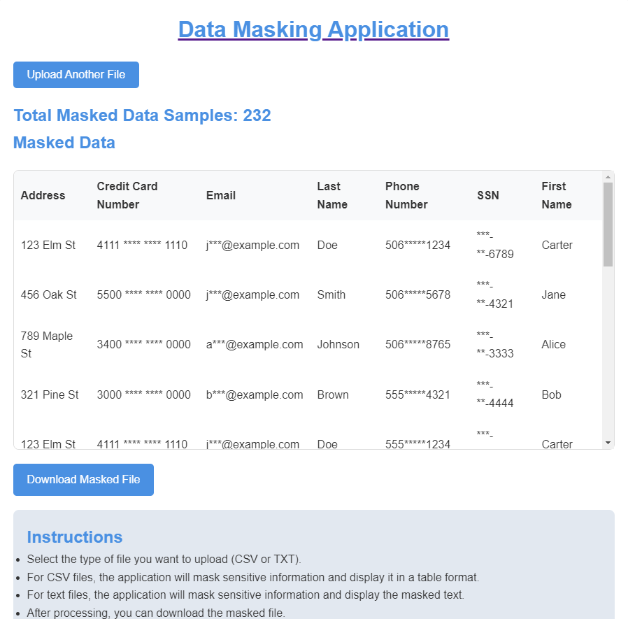

# Data Masking Application

This is a Flask-based web application that allows users to upload data files containing sensitive information. The application automatically detects and masks sensitive data such as email addresses, phone numbers, credit card numbers, and Social Insurance Numbers (SINs). The masked data can be viewed in a table format and downloaded as a file.

## Features

- **CSV and Text File Upload**: Upload comma-separated files (CSV) or text files containing data that may include sensitive information.
- **Automatic Data Masking**: Automatically detect and mask sensitive information like email addresses, phone numbers, credit card numbers, and SINs.
- **NLP Integration**: Utilizes Natural Language Processing (NLP) to detect sensitive information in uploaded text files.
- **Download Masked Data**: After processing, the application provides an option to download the masked data.
- **Dashboard**: Displays the total number of data samples masked to date.

## Tech Stack

- **Python**: The primary programming language used.
- **Flask**: A lightweight WSGI web application framework for building the application.
- **GitHub Actions**: Continuous Integration/Continuous Deployment (CI/CD) for testing and building the application.
- **Docker**: Used for containerizing the application, making it easy to deploy.

## Installation

### Prerequisites

- Python 3.10 or later
- Docker (if you want to run the application in a container)

### Clone the Repository

```bash
git clone https://github.com/yourusername/data-masking-app.git
cd data-masking-app
```

### Screenshot


